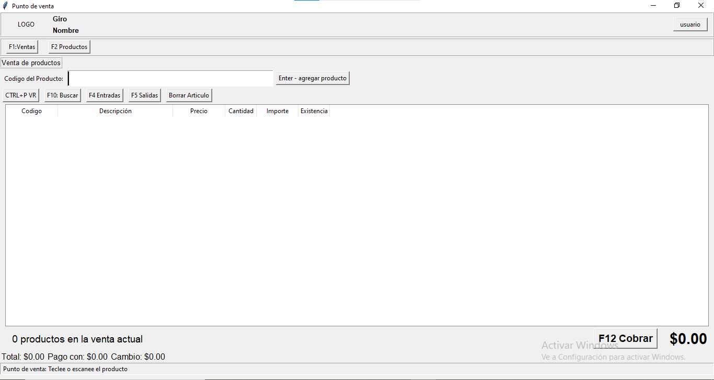
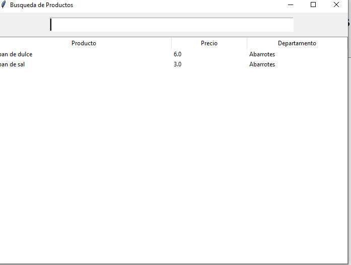
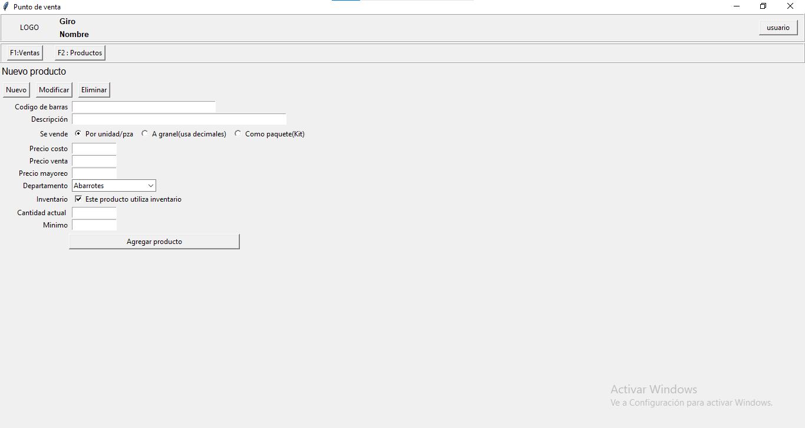

# 🛒 Sistema de Punto de Venta (POS)

Aplicación desarrollada en Python que simula el funcionamiento de una caja registradora.

## 🚀 Funcionalidades

- Agregar productos desde catálogo
- Carrito de compras
- Cálculo automático de total
- Generación de ticket
- Almacenamiento de ventas en JSON
- Historial de ventas

## 🧱 Estructura

- main.py → Ejecuta el programa
- caja.py → Lógica principal del sistema
- producto.py → Clase de productos
- productos.json → Catálogo
- ventas.json → Historial de ventas

## 📸 Capturas del sistema

### Pantalla principal


### Pantalla busqueda de productos


### Pantalla productos agregar un nuevo producto


## ▶️ Ejecución

```bash

run interface:
python interfaz.py